# **Memory Master**
## **Site Overview**
Memory Master is an engaging memory game that helps the user improve cognitive skills while having an awesome time. 
​
We provide a fun game in a relaxing gaming environment. Our target audience are people who like to play online games, primarily those who prefer genres such as puzzle and strategy. We also like to attract people who are seeking fun ways to improve their memory as well as being challenged. Since we provide different variations of themes and difficulties, Memory Master is suitable for all ages.

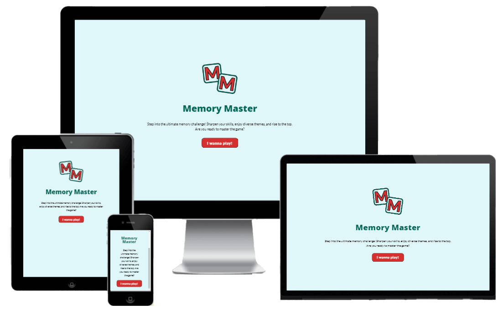
​
## Table of contents:
1. [**Site Overview**](#site-overview)
1. [**Planning stage**](#planning-stage)
    * [***Target Audiences***](#target-audiences)
    * [***User Stories***](#user-stories)
    * [***Site Aims***](#site-aims)
    * [***Wireframes***](#wireframes)
    * [***Color Scheme***](#color-scheme)
    * [***Typography***](#typography)
    * [***Game rules and mechanics***](#game-rules-and-mechanics)
1. [**Current Features**](#current-features-common-to-all-pages)
    * [***Logo***](#logo)
    * [***Title***](#title)
    * [***Navigation***](#navigation)
    * [***Header***](#header)
    * [***Instructions***](#instructions)
    * [***Settings/Choices***](#settingschoices)
    * [***Game Board***](#game-board-1)
    * [***Score Board***](#score-board)
1. [**Future-Enhancements**](#future-enhancements)
1. [**Testing Phase**](#testing-phase)
1. [**Deployment**](#deployment)
1. [**Tech**](#tech)
1. [**Credits**](#credits)
    * [**General reference**](#general-reference)
    * [**Content**](#content)
    * [**Media**](#media)
​
## **Planning stage**
### **Target Audiences:**
* Users interested in online games without creating an account.
* Users interested in getting challenged.
* Users interested in improving their memory in an interactive way.
​
### **User Stories:**
* As a user, I want to be entertained by playing online games that enhance my cognitive skills.
* As a user, I want to be able to adjust the difficulty to keep getting challenged.
* As a user, I want to increase my brain function and improve both my short- and long-term memory. 
* As a user, I want to challenge myself and improve my skills.
​
### **Site Aims:**
​​
* To provide a fun, engaging and interactive online game.
* To challenge the users memory skills to improve cognitivity.
* To offer a variety of options to keep the user entertained.

​
​
### **Wireframes:**
**Desktop**
​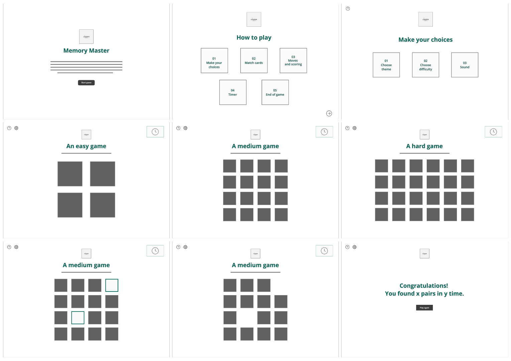

**Tablet**
​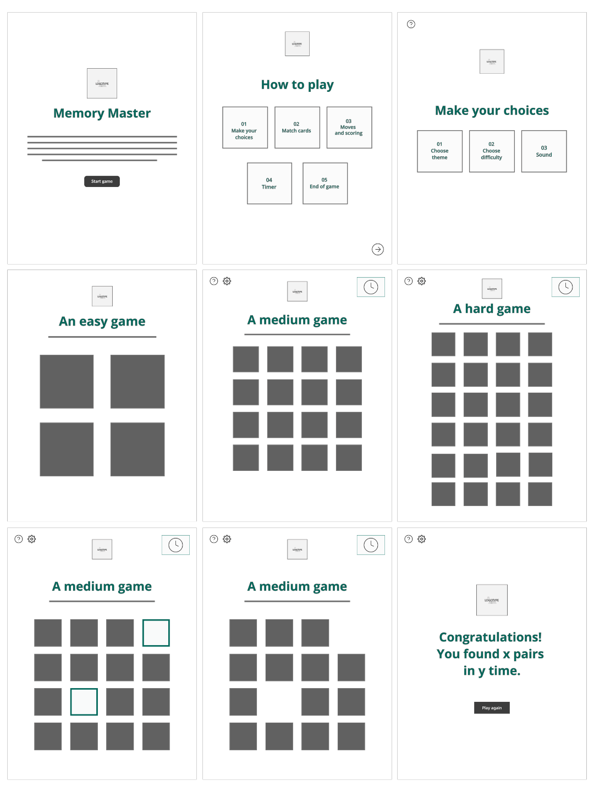

**Mobile**
​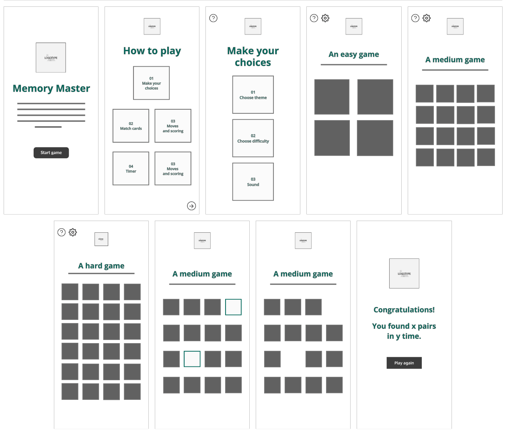
​
### **Color Scheme:**
We have made a colour palette for Memory Master to create a harmonious and engaging gaming environment. Shades of blue and green are our main colours with a touch of red in our dark accent colour to make important elements pop compared to other elements.

​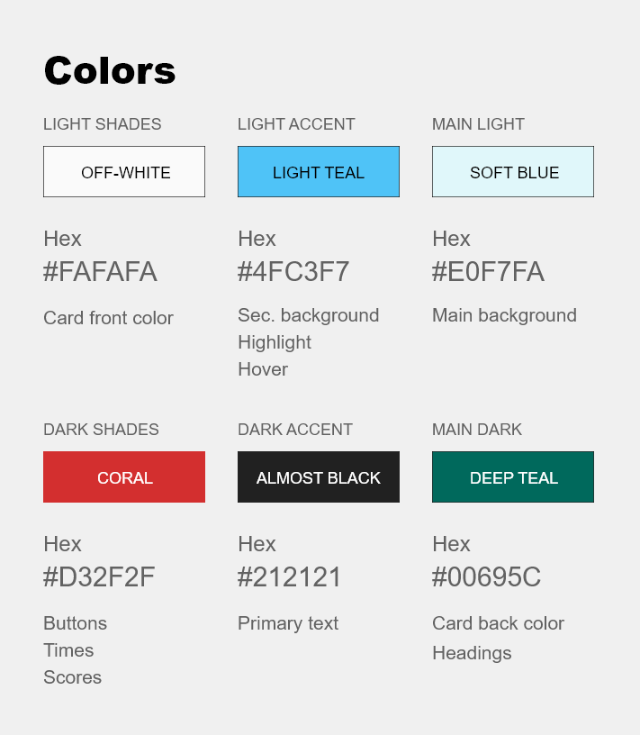
 
**General benefits for our colour palette**
* The palette is not overly vibrant or distracting, allowing players to focus on the gameplay and memory tasks.
* The colours, when used with proper contrast, can cater to a wider audience, including those with visual impairments.
* The calming nature of the primary colours can set a relaxed mood, making the game more enjoyable and less stressful.
* Different shades and contrasts allow for a clear distinction between flipped and unflipped cards, matched pairs, and other game elements.
 

**Colour explanation**
**Soft blue** (#E0F7FA): Our main colour is a gentle shade that provides a serene backdrop, setting a calming atmosphere that's conducive for concentration and focus, essential for a memory game.

**Light teal** (#4FC3F7): Belonging to the same colour family as the soft blue to ensure cohesiveness and a harmonious look. The colour adds a splash of vibrancy and playfulness, making the game interface lively and inviting.

**Deep teal** (#00695C): Our choice of dark main colour is a shade of teal, which offers depth and contrast to our palette. It's a colour that exudes sophistication and stability, reinforcing the game's credibility.

**Off-white** (#FAFAFA): A neutral hue that offers purity of style and ensures that the game elements are easily discernible and improves overall visual clarity. 

**Coral** (#D32F2F): Our vibrant accent colour captures attention and is perfect for highlighting important game elements. Its warm contrasts create a good dynamic in the interface with the cooler shades. 

**Almost black** (#212121): For our paragraphs we have chosen a foundational colour. It ensures legibility and provides a solid contrast against the lighter shades in the palette.
 
​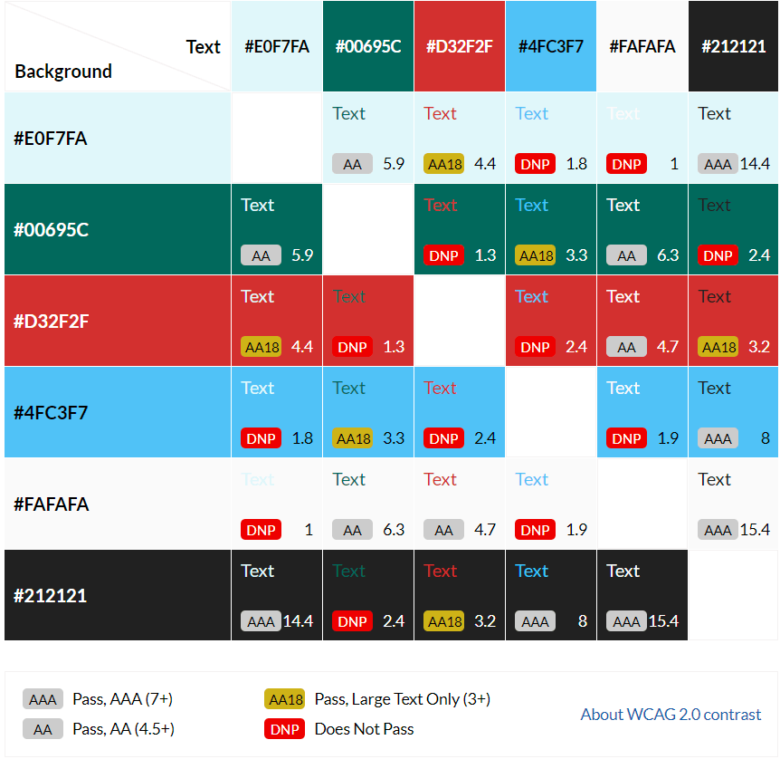
 
Together, these colours not only create a visually appealing interface but also prioritise user experience, ensuring that Memory Master is both delightful to play and easy on the eyes. 
All colour combinations are tested with WebAIM AAA, to ensure accessibility. 

## **Typography**
* We have chosen to use two fonts for Memory Master:
  * [Open Sans](https://fonts.google.com/specimen/Open+Sans?query=open+sans) - For all the headings.
  * [Lato](https://fonts.google.com/specimen/Lato?query=lato) - For all body text.
  * Lato Bold - For all buttons.  
 
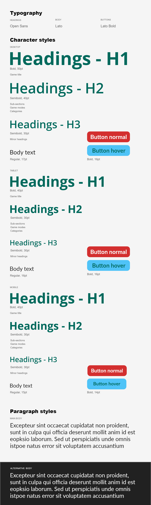
​ 
* Both Open Sans and Lato are sans-serifs and known for clarity and simplicity, which is very suitable for a game interface where quick readability might be crucial. These fonts can ensure that users can easily read instructions, scores and other game-related texts. 
* The fonts provide clean lines and modern design, perfect for a modern and memory game. 
* All fonts were sourced from Google fonts, as stated in the credits.
​
## **Game rules and mechanics**
Players must match pairs of cards based on memory. The goal is to match all pairs in the fewest moves and the shortest time possible.

**Game board**
* The game board consists of a grid of cards, face down.
* Grid size are adjusted depending on difficulty: 
    * Desktop:
        * Easy: 2*2 cards (total 4 cards, 2 pairs)
        * Medium: 4*4 cards (total 16 cards, 8 pairs) 
        * Hard: 6*4 cards (total 24 cards, 12 pairs)

    * Tablet and mobile:       
        * Easy: 2*2 cards (total t4 cards, 2 pairs)
        * Medium: 4*4 cards (total 16 cards, 8 pairs) 
        * Hard: 4*6 cards (total 24 cards, 12 pairs)

**Card matching**
* Every card has a twin, two of the cards have the same symbol.
* Users flip two cards at the time, trying to find the matching pairs.
* If the card matches, they will disappear from the grid. If not, they flip back face down.

**Moves and scoring**
* Each attempt to match two cards counts as a move.
* The game tracks the number of moves made.
* Users are scored based on the number of moves: fewer moves results in a higher score.

**Timer**
* A timer starts when the game begins, tracking how long the player takes to match all pairs.

**End of game**
* The game ends when all card pairs are matched.
* Users receive feedback on their performance, including time and total moves. 

## **Current Features**

### **Logo**
The logotype is M on cards as suitable for this type of game. We chose to use two M because of the game name **M**emory **M**aster and putting each one on the back of cards since the game is all about flipping cards and finding pairs. 

* The Memory Master logotype is included in all pages, always displayed on top.
* The logotype is linked to the start page.
* Has a smaller ratio on smaller screens and on pages with less space. 

### **Title**
All pages have a title to make it obvious to the user what the page is about.

​

​*Title: instructions.html*

* Gives the user a clear understanding about what the page is about. 

### **Header and top navigation:**
All pages except index.html and results.html have a header. The header differs slightly depending on the page, images below show the difference between different headers on different pages.

​

​*Header: instructions.html*
* Only contains the linked logotype for recognition factor.

​

​*Header: Choices.html*
* Question mark icon linking to the instructions, making it easy for the user to get back to see how to play the game.
* Linked logotype for recognition factor.

​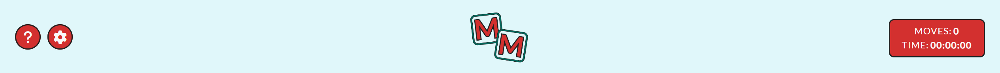

​*Header: Game pages*
* Question mark icon linking to the instructions, making it easy for the user to get back to see how to play the game. ***Placement to the left.***
* Gear icon links to the settings/choice page, making it easy for the user to switch settings and options. ***Placement to the left next to the question mark icon.***
* Linked logotype for recognition factor. ***Placement in the middle.***
* The counter gives the user an overview of how many attempts have been made. ***Placement to the right above time.***
* The timer gives an overview of how long the user has taken to find the pairs. ***Placement to the right.***

​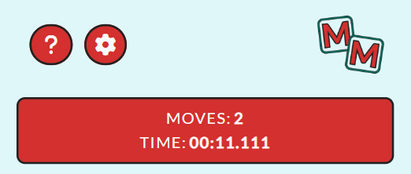

* The header is responsive and will stack the elements on smaller screens to give a better user experience. 

### **Footer navigation:**
The instructions page has a footer navigation in the bottom right to skip the instruction and forward to the settings page.

​
​
* Easy for the user to move fast forward. 
* The arrow makes it clear that clicking would take the user to the next step. 

### **Instructions:**
When starting the game the user gets instructions on how to play.  

​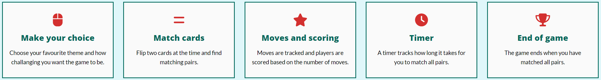
​ 
* Easy for the user to understand what the game is about.
* The user gets to know the flow, how to start the game and when it ends.

### **Settings and choices:**
Before starting the game, the user gets to choose the theme, difficulty and if they want sound effects. 

​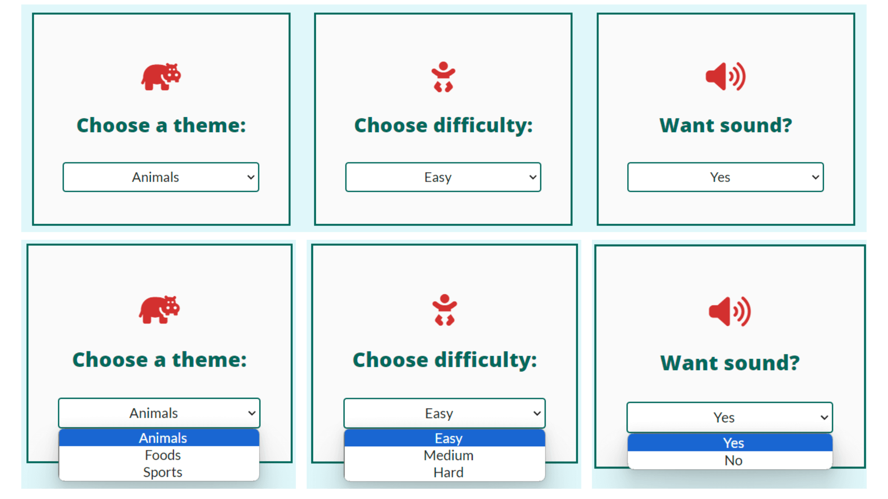
​ 
* Users make their choice through a dropdown menu with one option.
* Options are divided boxes to provide more clarity about what settings/choices are being made. 

### **Game board:**
All game pages have memory cards that flip when clicking them. They are flipping back if no match is found and hidden if a match is found.
The cards include icons of chosen themes and the cards have sound effects when flipping, finding or not finding a match to make the game more fun.

​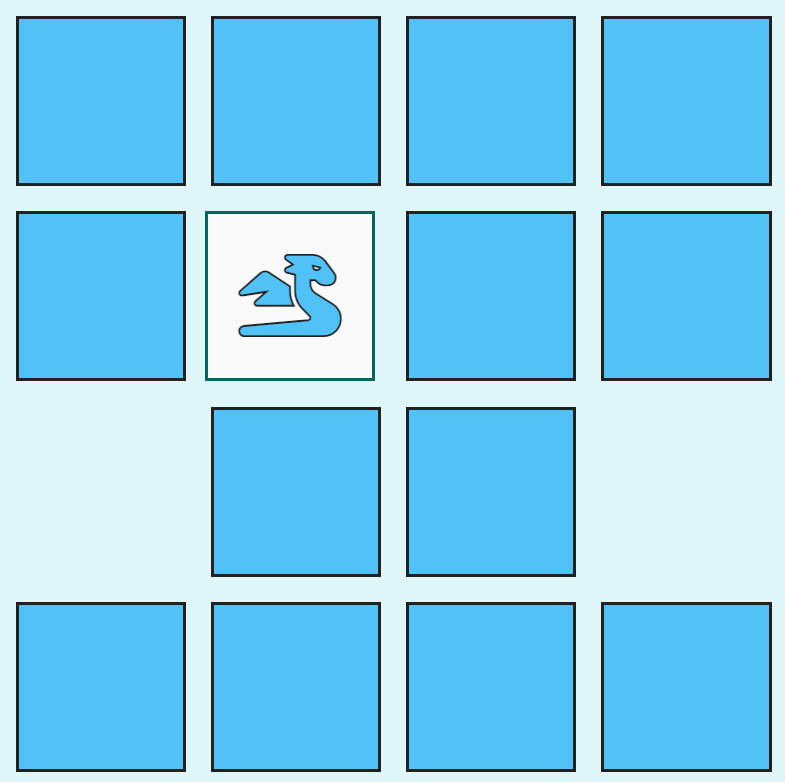
​ 
* Easy for the user to know if it is a match or not. 
* More fun for the user with different themes. 

### **Score board:**
When the game is finished, the user goes to the results page where they find their score.

​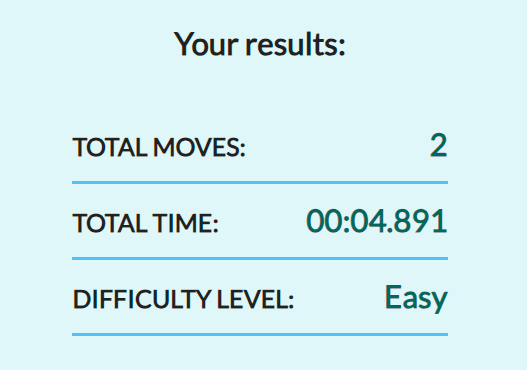
​ 
* Users can see how long it took to finish the game.
* Users see the amount of attempts needed to finish the game.
* Users see what difficulty level the game was.
​
## **Future-Enhancements**
​
We believe that Memory Masters have a lot of potential and can be enhanced in many ways. 
​
* Make it possible for users to play against each other or a computer.
* Collect scores among users, a high score page, so the users can rank themselves in comparison to other players.
* Let the users be able to create an account to save their scores (movies and times).
​
## **Testing Phase**
To test the games responsiveness and functionality we have performed different types of manual testing on a variety of browsers and devices, all described below. The bugs we found are described under [bugs](#bugs) with an explanation of our solutions.

### **Responsiveness**
We have tested the responsiveness of the game in several browsers and devices, to ensure cross-compatibility which will provide the expected user experience.

**Browsers used for the testing**

Responsiveness has been tested using DevTools for each browser, both on chosen dimensions and by making the window smaller. 

* Google Chrome
* Mozilla Firefox
* Microsoft Edge

**Tablet used for the testing**

* Apple Ipad Air (4th gen) - Google Chrome, Safari
* Samsung Galaxy A7 - Google Chrome

**Mobile phones used for the testing**

* Samsung Galaxy S22 Ultra - Google Chrome
* Samsung Galaxy A54 - Google Chrome
* OnePlus 9 Pro - Mozilla Firefox

### **Functionality**
Functionality has been tested by clicking all elements in the game to see what happens and if the expected action occurs. 
* Elements that occur on several pages and have the same results are described under Global below. 
* Tests were performed on all elements page by page, page specific element tests are described under the page name. 
* All headlines and texts are clearly visible in all browsers and on all devices we have tested the game on. 

**Browsers used for testing**
* Google Chrome
* Mozilla Firefox
* Microsoft Edge

**Tablet used for testing**

* Apple Ipad Air (4th gen) - Google Chrome, Safari
* Samsung Galaxy A7 - Google Chrome

**Mobile phones used for the testing**

* Samsung Galaxy S22 Ultra - Google Chrome
* Samsung Galaxy A54 - Google Chrome

#### **Global elements**

1. **Header**
    1.1. **Question mark icon**
            * Placement: Top left.
            * On hover: Background shifters colour from red to green, the border disappears. - Works as expected.
            * On click: Redirect to instructions page. - Works as expected.

    1.2. **Logotype**
            * Placement: Top middle.
            * On hover: Nothing happens. - Works as expected.
            * On click: Redirect to the index page. - Works as expected.

    1.3. **Gear icon**
        * Placement: Top left next to question mark icon.
        * On hover: Background shifters colour from red to green, the border disappears. - Works as expected.
        * On click: Redirect to settings/choice page. - Works as expected.

    1.4. **Movies counter**
        * Placement: Top right.
        * On hover: Nothing happens. - Works as expected.
        * On click: When clicking a card on the game board the counter adds it to moves. - Works as expected.

    1.5. **Timer**
        * Placement: Top right below moves counter.
        * On hover: Nothing happens. - Works as expected.
        * On click: When clicking the first card on the game board the counter automatically starts counting the time. - Works as expected.

#### **Index page**
Page elements: Logotype, H1, paragraph, button.

1. **Logotype**
    * Placement: Middle top. 
    * On hover: Nothing happens. - Works as expected.
    * On click: Redirects to index page (reloads index page). - Works as expected.

1. **Button: "I wanna play!"**
    * Placement: Middle bottom.
    * On hover: Fades slowly from red to light blue. - Works as expected.
    * On click: Redirects to How to play/instructions page. - Works as expected.

#### **Instructions page**
Page elements: Header (Logotype), H1, five instruction cards with an icon, headline and text, arrow icon.

1. **Arrow icon**
    * Placement: Down right corner.
    * On hover: The background shifters colour from red to green, the border disappears. - Works as expected.
    * On click: Redirect to settings/choice page. - Works as expected.

#### **Settings/choice page**
Page elements: Header (Question mark icon, logotype), H1, three choice cards with an icon, headling, options dropdown, button. 

1. **Choice cards**
    * Choice card 1: Theme.
        * Placement: Left.
        * Default option: Animals.
        * On hover: Nothing happens. - Works as expected.
        * On click: Opens dropdown with three options: Animals, foods, sports. - Works as expected.
        * On click on options: Activate chosen option and close dropdown. - Works as expected.

    * Choice card 2: Difficulty.
        * Placement: Middle.
        * Default option: Easy.
        * On hover: Nothing happens. - Works as expected.
        * On click: Opens dropdown with three options: Easy, Medium, Hard. - Works as expected.
        * On click on options: Activate chosen option and close dropdown. - Works as expected.

    * Choice card 3: Sound.
        * Placement: Right.
        * Default option: No.
        * On hover: Nothing happens. - Works as expected.
        * On click: Opens dropdown with three options: No, Yes - Works as expected.
        * On click on options: Activate chosen option and close dropdown. - Works as expected.

4. **Button: Start game**
    * Placement: Middle bottom.
    * On hover: Background shifters colour from red to green, the border disappears. - Works as expected.
    * On click: Redirects to game page with game board based on difficulty - Works as expected.

#### **Game pages**
Page elements: Header (Question mark icon, gear icon, logotype, movies counter, timer), H1, game board based on difficulty level, symbols based on theme.
All themes have been tested on every difficulty level, both with and without sound.

1. **Cards back**
    * Placement: Middle of page.
    * On hover: Nothing happens. - Works as expected.
    * On click: Card turns and if the user chooses to use sound, the flip sound plays automatically. - Works as expected.

2. **Cards front**
    * Placement: Middle of flipped cards. 
    * On hover: Nothing happens. - Works as expected.
    * On click before solution: Game thinks it is a match. - Did not work as expected, explanation of issues and solution in [bugs](#bugs) number 2.
    * On click after solution: Pop up alerts the user that the card already has been flipped.

3. **Symbols**
    * Symbols were too big for the cards. - Explanation of issues and solution in [bugs](#bugs) number 3.
    * Some symbols were not visible in medium/hard game mode. - Explanation of issues and solution in [bugs](#bugs) number 4.

3. **Pairs**
    * Medium/hard mode: The user could not win the game because the game did not detect all pairs. - Explanation of issues and solution in [bugs](#bugs) number 1.
    * If a match is found the match sound will play, if the user chooses to play with sound. - Works as expected.
    * If no match is found the noMatch sound will play, if the user chooses to play with sound. - Works as expected.
    * When all pairs are found the game redirects the user to the results page. - Works as expected.

#### **Results page**
Page elements: Logotype, H1, sub-title, score board, button.

1. **Logotype**
    * Placement: Middle top. 
    * On hover: Nothing happens. - Works as expected.
    * On click: Redirects to index page (reloads index page). - Works as expected.

2. **Score Board**
    * Shows: Moves, time, difficulty level. - Works as expected.
    * Results matches based on the game played. - Works as expected.

3. **Button: Play again**
    * Placement: Middle bottom.
    * On hover: Background shifters colour from red to green, the border disappears. - Works as expected.
    * On click: Redirects to settings/choice page to let the user choose difficulty level and theme. - Works as expected.

### **Validators**
All validators were used in incognito mode. 

#### **HTML** - (https://validator.w3.org/)
​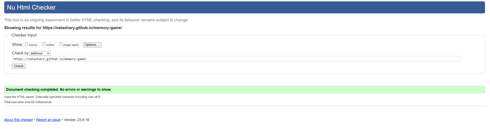
* No errors were found.

#### **CSS** - (https://jigsaw.w3.org/css-validator/)
​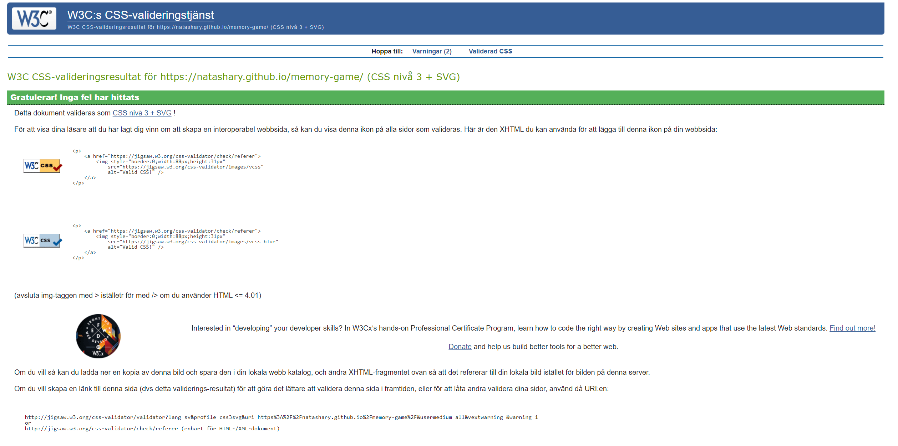

* No errors were found. 

#### **Jshint** - (https://jshint.com/)
​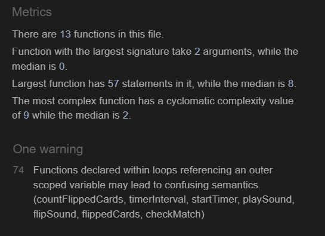
​
* Issue found:
    * *"Warning: Functions declared within loops referencing an outer scoped variable may lead to confusing semantics. (countFlippedCards, timerInterval, startTimer, playSound, flipSound, flippedCards, checkMatch)"*
* Solution: 
    * To resolve the issue of functions within loops we added a function "createCardClicked(card)" that returns a new function, which calls "cardClicked(card)", ensuring the "card" parameter is correctly scoped. The "addEventListener '' method within the for-loop now calls "createCardClicked(card)" to resolve the issue of creating functions within the loop and referencing outer scoped variables directly. 

 
### **Lighthouse Score**
* The tests were performed in incognito mode.
* Both desktop and mobile tests were performed on all pages.
* The game site is lightweight without any images except for the logotype. 
* We have used aria-labels on the linked icons; all pages have unique meta titles and descriptions.
* All pages have unique meta titles as well as meta descriptions.

#### **Score**
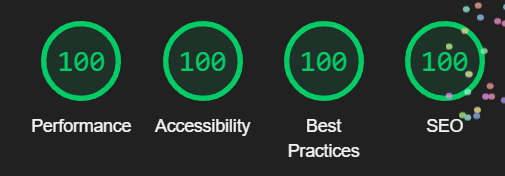

*Desktop score: Index.html*

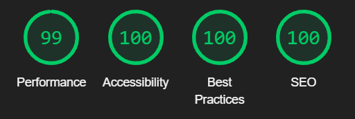

*Mobile score: Index.html*

**Performance**
* Desktop 100 on all pages.
* Mobile 99 on all pages.

* Issue on mobile: ***Resources are blocking the first paint of your page. Consider delivering critical JS/CSS inline and deferring all non-critical JS/styles.***
* Solution: This is not something we will fix at this time. The affected resources are Google Fonts and Font Awesome from which we get fonts and symbols. In the future this could be fixed by using local fonts and symbols or using a web font loader, optimising critical CSS and so on. 

**Accessibility**
* Desktop 100 on all pages.
* Mobile 100 on all pages.

**Best Practices**
* Desktop 100 on all pages except results.html (92).
* Mobile 100 on all pages except results.html (92).

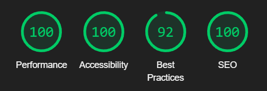

*Desktop score: Results.html*

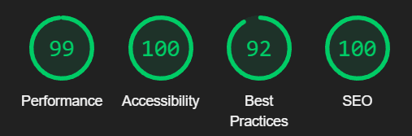

*Mobile score: Results.html*

* Results page (92): 
    * Issue for both desktop and mobile: ***"Errors logged to the console indicate unresolved problems. They can come from network request failures and other browser concerns"***
    * Solution: We do not intend to fix this problem since the users chooses to use audio or not in the beginning of the game. The audio auto plays to give the user a pleasant surprise if sound is chosen. 

**SEO**
* Desktop 100 on all pages.
* Mobile 100 on all pages.

### **Accessibility**
We also used [WAVE](https://wave.webaim.org/) to test the accessibility on every page and no errors were found.

​
## **Bugs**
1. **Game did not detect matching pairs even though there were a match**
* Issue found: During development
    * Problems matching all pairs on difficulty level medium (one match could not be made) and hard (two pairs could not be matched).
* Solution: 
    * By making new divs in the HTML-code for the cards that could not match the problem got solved. We could not see any problems with the existing divs, but changing them helped. 
 

 2. **Pair detected when clicking the same card**
* Issue found: During testing
    * When testing the functionality we realised the game would count two clicks on the same card as a pair. 
* Solution: 
    * But by adding an if-statement in the "cardClicked '' function we could prohibit the user from clicking the same card twice in the same attempt. We also chose to send a pop up message to alert the user that the card already has been flipped. 

3. **Symbol size**
* Issue found: During testing
    * While testing the game boards on mobile devices we realised the symbols were bigger than the cards.
* Solution: 
    * By decreasing the font-size of the symbols for 480px media query we could solve the problem. 

4. **None visible symbols** 
* Issue found: During development
    * While developing the game we realised that some cards did not have symbols when they were flipped.
* Solution: 
    * Using DevTools we could detect the symbols not visible and remove them from the game, which solved the problem. 

​
***
## **Deployment**
I deployed the page on GitHub pages via the following procedure: 
​
1. From the project's [repository](https://github.com/NatashaRy/memory-game), go to the **Settings** tab.
2. From the left-hand menu, select the **Pages** tab.
3. Under the **Source** section, select the **Main** branch from the drop-down menu and click **Save**.
4. A message will be displayed to indicate a successful deployment to GitHub pages and provide the live link.
​
You can find the live site via the following URL - [Memory Master | The Ultimate Memory Game](https://natashary.github.io/memory-game/)
***
## **Tech**
- HTML
- CSS
- JavaScript
​
## **Credits**
### **Content:**
* All code was written by me, some code is inspired by others who are referenced below. 
* All fonts are imported from [Google Fonts](https://fonts.google.com)
* All icons on memory cards are taken from [Font Awesome](https://fontawesome.com/)
* Animations on buttons are inspired from [W3School](https://www.w3schools.com/css/css3_animations.asp)
* Flipping card with CSS from [W3School](https://www.w3schools.com/howto/howto_css_flip_card.asp)
* Spread operator for cloning symbols array with  from [Tutorialspoint](https://www.tutorialspoint.com/javascript-spread-operator#:~:text=The%20JavaScript%20spread%20operator%20allows,preceded%20by%20the%20array%20name.)
* Code for delaying cards flipping back if they don't match from [Stackoverflow](https://stackoverflow.com/questions/17883692/how-to-set-time-delay-in-javascript)
* For some of the texts are written or modified by [ChatGPT](https://chat.openai.com/)
* For alert pop up we used [SweetAlert](https://sweetalert2.github.io/#examples)

### **Media:**
* Memory Masters logotyp was created with [Canva](https://canva.com)
* Images compressed with [TinyPNG](https://tinypng.com/)
* Sound effects are taken from [Pixabay](https://pixabay.com/sound-effects/search/)
* Screenshot in README.md under "site overview" was created with [Am I Responsive](https://ui.dev/amiresponsive)
* Favicon created with [Favicon.ic](https://favicon.io/favicon-converter/)
* Wireframes were created in [Adobe XD](https://adobexdplatform.com/)
