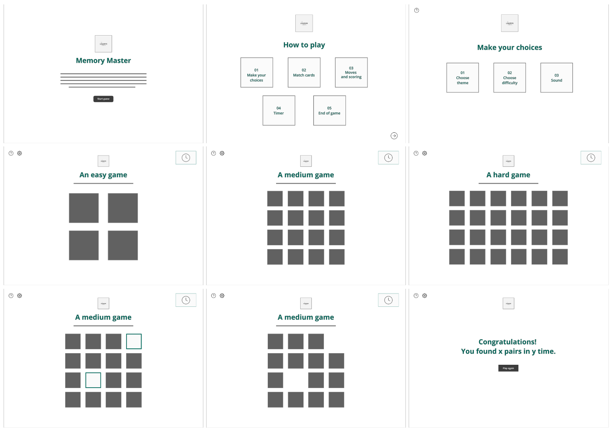
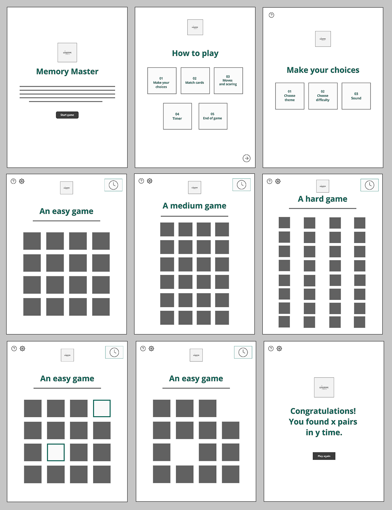
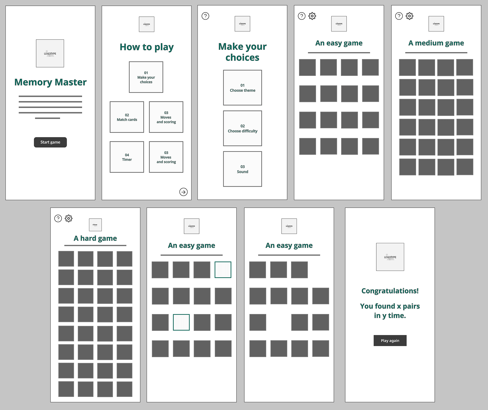

# **Memory Master**
## **Site Overview**
Memory Master is an engaging memory game that help the user improve cognitive skills while having an awesome time. 
​
We provide a fun game in a relaxing gaming enviroment. Our target audience are people who like to play online games, primarily those who prefer genres as puzzle and strategy. We also like to attract people who are seeking fun ways to improve their memory aswell as being challanged. Since we provide different variations of themes and difficulites Memory Master is suitable for all ages.

​
## Table of contents:
1. [**Site Overview**](#site-overview)
1. [**Planning stage**](#planning-stage)
    * [***Target Audiences***](#target-audiences)
    * [***User Stories***](#user-stories)
    * [***Site Aims***](#site-aims)
    * [***Wireframes***](#wireframes)
    * [***Color Scheme***](#color-scheme)
    * [***Typography**](#typography)
1. [**Current Features Common to all pages**](#current-features-common-to-all-pages)
    * [***Header Element:***](#header-element)
    * [***The rest of your features***](#features)
    * [**Footer**](#footer)
1. [**Future-Enhancements**](#future-enhancements)
1. [**Testing Phase**](#testing-phase)
1. [**Deployment**](#deployment)
1. [**Tech**](#tech)
1. [**Credits**](#credits)
    * [**Honorable mentions**](#honorable-mentions)
    * [**General reference**](#general-reference)
    * [**Content**](#content)
    * [**Media**](#media)
​
## **Planning stage**
### **Target Audiences:**
​​
* Users interested in online games without creating an account.
* Users intrested in getting challanged.
* Users interested in improving their memory in an interactive way.
​
### **User Stories:**
​​
* As a user, I want to be entertained by playing online games that enhance my cognitive skills.
* As a user, I want to be able to adjust the difficulty to keep getting challanged.
* As a user, I want to increse my brain function and improving both my short- and long-term memory. 
* As a user, I want to challenge myself and improve my skills.
​
### **Site Aims:**
​​
* To provide a fun, engaging and interactive online game.
* To challange the users memory skills to improve cognitivity.
* To offer a vary of options to keep the user entertained.
​
​
### **Wireframes:**
#### **Pages on desktop**

#### **Pages on tablet**

#### **Pages on mobile**

​
### **Color Scheme:**
We have made a color palette for Memory Master to create a harmounious and engaging gaming enviroment. Shades of blue and green are our main colors with a touch of red in our dark accent color to make importent elements pop compared to other elements.

​

#### **General benefits for our color palette**
* The palette is not overly vibrant or distracting, allowing players to focus on the gameplay and memory tasks.
* The colors, when used with proper contrast, can cater to a wider audience, including those with visual impairments.
* The calming nature of the primary colors can set a relaxed mood, making the game more enjoyable and less stressful.
* Different shades and contrasts allow for a clear distinction between flipped and unflipped cards, matched pairs, and other game elements.

#### **Color explaination**
**Soft blue** (#E0F7FA): Our main color is a gentle shade provides a serene backdrop, setting a calming atmosphere that's conducive for concentration and focus, essential for a memory game.

**Light teal** (#4FC3F7): Beloning to the same color family as the soft blue to ensure cohesiveness and a harmonious look. The color adds a splash of vibrancy and playfulness, making the game interface lively and inviting.

**Deep teal** (#00695C): Our choice of dark main color is a shade of teal, which offers depth and contrast to our palette. It's a color that exudes sophistication and stability, reinforcing the game's credibility.

**Off-white** (#FAFAFA): A neutral hue that offers purity of style and ensures that the game element are easily discernible and improves overall visual clarity. 

**Coral** (#D32F2F): Our vibrant accent color captures attention and is perfect for highlighting important game elements. Its warm contrasts create a good dynamic in the interface with the cooler shades. 

**Almost black** (#212121): For our paragraphs we have chosen a foundational color. It ensures legibility and provides a solid contrast against the lighter shades in the palette.

Together, these colors not only create a visually appealing interface but also prioritize user experience, ensuring that Memory Master is both delightful to play and easy on the eyes. 
All color combinations are tested with WebAIM AAA, to ensure accessability. 

## **Typography**
* We have chosen to use two fonts for Memory Master:
  * Open Sans - For all the headings.
  * Lato - For all body text.
  * Lato Bold - For all buttons.  

​
* Both Open Sans and Lato are sans-serifs and known for clarity and simplity, which is very suitable for a game interface wher quick readability might be crucial. These fonts can ensure that users can easily read instruction, scores and other game-related texts. 
* The fonts provides clean lines and modern design, perfect for a modern and memory game. 
* All fonts were sourced from Google fonts, as stated in the credits.
​
## **Game rules and mechanics**
Players must match pairs of cards based on memory. The goal is to match all pairs in the fewest moves and the shortest time possible.

### **Game board:**
* The game board consist of a grid of cards, face down.
* Grid size are adjusted depending on difficulty: 
    * Desktop:
        * Easy: 4*4 cards (totalt 16 cards, 8 pairs)
        * Medium: 6*4 cards (totalt 24 cards, 12 pairs) 
        * Hard: 8*4 cards (totalt 32 cards, 16 pairs)

    * Tablet and mobile:       
        * Easy: 4*4 cards (totalt 16 cards, 8 pairs)
        * Medium: 4*6 cards (totalt 24 cards, 12 pairs)
        * Hard: 4*8 cards (totalt 32 cards, 16 pairs)

### **Card matching**
* Every card has a twin, two of the cards has the same symbol.
* Users flip two cards at the time, trying to find the matching pairs.
* If the card matches, they will disapear from the grid. If not, they flip back face down.

### **Moves and scoring**
* Each attempt to match two cards count as a move.
* The game tracks the number of moves made.
* Users are scored based on the number of moves: fewer moves results in a higher score.

### **Timer**
* A timer starts when the game begins, tracking how long the player takes to match all pairs.

### **End of game**
* The game ends when all card pair are matched.
* Users recive feedback on their performance, including time and total moves. 

## **Current Features Common to all pages**
​
#### *Navigation Bar:*
This is an example of the features section, your going to talk about each section of the page and what it offers for the navbar for example
​
* The user is given links to each section of the page
* Each option is presented in a way that is always obvious and reable
* on smaller screens a hamburger menu is provided to ensure mobile users have an optimal experience
​
#### *features
​
* This is where you will place all of your features think about each section of the page include a screenshot and a few bullet points on how it's presented and why
​
## **Future-Enhancements**
​
A webpage is a living beast it's going to evolve past the initial stages of release generally, it's always good to discuss where you this the page may go in the future
​
* At the time of making this page i didn't have the understanding to actual send e-mails from the contact form so intergration with email.js to send e-mails would improve the users experience
​
* Due to the subject matter, we have discussed the idea of including a small JS game to engage the user
​
## **Testing Phase**
​
This is the hardest bit of the readme, when we have completed a page we need to discuss testing.
​
Here is a good idea to talk about how and why you have tested with certain tools and validators so here a list of things to talk through
​
* Responsiveness - How do you test this, dev tools? checking on multiple devices?
​
* Functionality - Each feature needs to be tested before something is complete, talk about the process, click each link check each image, does form validation work, if your using javascript or anything else, does it always behave as the user expects
​
* Validators - Here include images from w3c html validator and css jigsaw (jshint for js and pep8 for python) and the results that came from it
​
​
## **Bugs**
​
We always have bugs in development, a few bullet points here to talk about bugs you found and how you fixed them, in later projects this will be more detailed
​
* Issue - When on mobile the user had horizontal scroll with items overflowing
* Cause - The images had absolute positioning and caused them to go off screen
* Resolution - Changed the width of the image to stay within the confines of the screen.
​
***
## **Deployment**
I deployed the page on GitHub pages via the following procedure: -
​
1. From the project's [repository](https://github.com/NatashaRy/memory-game), go to the **Settings** tab.
2. From the left-hand menu, select the **Pages** tab.
3. Under the **Source** section, select the **Main** branch from the drop-down menu and click **Save**.
4. A message will be displayed to indicate a successful deployment to GitHub pages and provide the live link.
​
You  can find the live site via the following URL - [live webpage](https://yoururlhere)
***
​
## **Tech**
​​
- HTML
- CSS
- JavaScript
​
## **Credits**
### **Honorable mentions**
​
It's always nice to mention those that helped you get there, if people gave you support on slack or the local cat scared you into completing give them a mention!
​
### **Content:**
​
* All fonts are imported from Google Fonts - 
* All icons on memory cards are taken from Font Awesome - 
* Wireframes were created in Adobe XD - 
  
### **Media:**
​
* Memory Masters logotyp was created with Canva - 
* TinyPNG was used for image compression - 