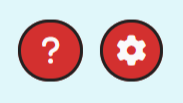
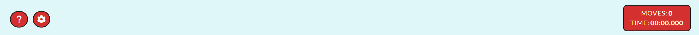

# **Memory Master**
## **Site Overview**
Memory Master is an engaging memory game that help the user improve cognitive skills while having an awesome time. 
​
We provide a fun game in a relaxing gaming enviroment. Our target audience are people who like to play online games, primarily those who prefer genres as puzzle and strategy. We also like to attract people who are seeking fun ways to improve their memory aswell as being challanged. Since we provide different variations of themes and difficulites Memory Master is suitable for all ages.

​
## Table of contents:
1. [**Site Overview**](#site-overview)
1. [**Planning stage**](#planning-stage)
    * [***Target Audiences***](#target-audiences)
    * [***User Stories***](#user-stories)
    * [***Site Aims***](#site-aims)
    * [***Wireframes***](#wireframes)
    * [***Color Scheme***](#color-scheme)
    * [***Typography***](#typography)
    * [***Game rules and mechanics***](#game-rules-and-mechanics)
1. [**Current Features**](#current-features-common-to-all-pages)
    * [***Logo***](#logo)
    * [***Title***](#title)
    * [***Navigation***](#navigation)
    * [***Header***](#header)
    * [***Instructions***](#instructions)
    * [***Settings/Choices***](#settingschoices)
    * [***Game Board***](#game-board-1)
    * [***Score Board***](#score-board)
1. [**Future-Enhancements**](#future-enhancements)
1. [**Testing Phase**](#testing-phase)
1. [**Deployment**](#deployment)
1. [**Tech**](#tech)
1. [**Credits**](#credits)
    * [**Honorable mentions**](#honorable-mentions)
    * [**General reference**](#general-reference)
    * [**Content**](#content)
    * [**Media**](#media)
​
## **Planning stage**
### **Target Audiences:**
* Users interested in online games without creating an account.
* Users intrested in getting challanged.
* Users interested in improving their memory in an interactive way.
​
### **User Stories:**
* As a user, I want to be entertained by playing online games that enhance my cognitive skills.
* As a user, I want to be able to adjust the difficulty to keep getting challanged.
* As a user, I want to increse my brain function and improving both my short- and long-term memory. 
* As a user, I want to challenge myself and improve my skills.
​
### **Site Aims:**
​​* To provide a fun, engaging and interactive online game.
* To challange the users memory skills to improve cognitivity.
* To offer a vary of options to keep the user entertained.
​
​
### **Wireframes:**
**Desktop**
​

**Tablet**
​

**Mobile**
​
​
### **Color Scheme:**
We have made a color palette for Memory Master to create a harmounious and engaging gaming enviroment. Shades of blue and green are our main colors with a touch of red in our dark accent color to make importent elements pop compared to other elements.

​
 
**General benefits for our color palette**
* The palette is not overly vibrant or distracting, allowing players to focus on the gameplay and memory tasks.
* The colors, when used with proper contrast, can cater to a wider audience, including those with visual impairments.
* The calming nature of the primary colors can set a relaxed mood, making the game more enjoyable and less stressful.
* Different shades and contrasts allow for a clear distinction between flipped and unflipped cards, matched pairs, and other game elements.
 

**Color explaination**
**Soft blue** (#E0F7FA): Our main color is a gentle shade provides a serene backdrop, setting a calming atmosphere that's conducive for concentration and focus, essential for a memory game.

**Light teal** (#4FC3F7): Beloning to the same color family as the soft blue to ensure cohesiveness and a harmonious look. The color adds a splash of vibrancy and playfulness, making the game interface lively and inviting.

**Deep teal** (#00695C): Our choice of dark main color is a shade of teal, which offers depth and contrast to our palette. It's a color that exudes sophistication and stability, reinforcing the game's credibility.

**Off-white** (#FAFAFA): A neutral hue that offers purity of style and ensures that the game element are easily discernible and improves overall visual clarity. 

**Coral** (#D32F2F): Our vibrant accent color captures attention and is perfect for highlighting important game elements. Its warm contrasts create a good dynamic in the interface with the cooler shades. 

**Almost black** (#212121): For our paragraphs we have chosen a foundational color. It ensures legibility and provides a solid contrast against the lighter shades in the palette.
 
​
 
Together, these colors not only create a visually appealing interface but also prioritize user experience, ensuring that Memory Master is both delightful to play and easy on the eyes. 
All color combinations are tested with WebAIM AAA, to ensure accessability. 

## **Typography**
* We have chosen to use two fonts for Memory Master:
  * Open Sans - For all the headings.
  * Lato - For all body text.
  * Lato Bold - For all buttons.  
 

​ 
* Both Open Sans and Lato are sans-serifs and known for clarity and simplity, which is very suitable for a game interface wher quick readability might be crucial. These fonts can ensure that users can easily read instruction, scores and other game-related texts. 
* The fonts provides clean lines and modern design, perfect for a modern and memory game. 
* All fonts were sourced from Google fonts, as stated in the credits.
​
## **Game rules and mechanics**
Players must match pairs of cards based on memory. The goal is to match all pairs in the fewest moves and the shortest time possible.

**Game board**
* The game board consist of a grid of cards, face down.
* Grid size are adjusted depending on difficulty: 
    * Desktop:
        * Easy: 2*2 cards (totalt 4 cards, 2 pairs)
        * Medium: 4*4 cards (totalt 16 cards, 8 pairs) 
        * Hard: 6*4 cards (totalt 24 cards, 12 pairs)

    * Tablet and mobile:       
        * Easy: 2*2 cards (totalt 4 cards, 2 pairs)
        * Medium: 4*4 cards (totalt 16 cards, 8 pairs) 
        * Hard: 4*6 cards (totalt 24 cards, 12 pairs)

**Card matching**
* Every card has a twin, two of the cards has the same symbol.
* Users flip two cards at the time, trying to find the matching pairs.
* If the card matches, they will disapear from the grid. If not, they flip back face down.

**Moves and scoring**
* Each attempt to match two cards count as a move.
* The game tracks the number of moves made.
* Users are scored based on the number of moves: fewer moves results in a higher score.

**Timer**
* A timer starts when the game begins, tracking how long the player takes to match all pairs.

**End of game**
* The game ends when all card pair are matched.
* Users recive feedback on their performance, including time and total moves. 

## **Current Features**

### **Logo**
The Memory Master logotype is included in all pages, alway displayed on top.

* The logotype is linked to the start page.
* Has smaller ration on smaller screens and on pages with less space. 

### **Title**
All pages have a title to make it obvious to the user what the page is about.

​

​*Instructions.html*

* Gives the user a clear understanding about what the page is about. 

### **Navigation:**
Not all pages have a navigation. Game pages and settings pages have navigations on top left linking to instructions and setting (option not avalible on settings page). 

​

The instructions page have a navigation in the bottom right to skip the instruction and forward to the settings page.

​
​
* Each option is presented with icons which is easy to understand. 
* The user can easily changes the settings and go back to the instructions.
​
### **Header:**
The game pages and the settings page have a header that includes navigation links mentioned in the [navigation](#navigation) section, the logotype centered below the links and the game pages also have the moves counter and timer in the header to the right. 

​
​ 
* The counter gives the user an overview of how many attempts have been made.
* The timer gives and overview of how long the user has taken to find the pairs. 

### **Instructions:**
When starting the game the user get instructions how to play.  

​
​ 
* Easy for the user to understand what the game is about.
* The user gets to know the flow, how to start the game and when it ends.

### **Settings and choices:**
Before starting the game, the user get to choose theme, difficulty and if they want sound effects. 

​
​ 
* Users make their choice through a dropdown menu one every option.
* Options are divided boxes to provide more clarity about what settings/choice are being made. 

### **Game board:**
All game pages has memory cards that flips when clicking them. They are flipping back if no match is found and hidden if a match is found.
The cards include icons of chosen theme and the cards have sound effects when flipping, finding or not findig a match to make the game more fun.

​
​ 
* Easy for the user to know if it is a match or not. 
* More fun for the user with different themes. 

### **Score board:**
When the game if finished, the user goes to the results page where they find their score.

​
​ 
* User can see how long it took to finish the game.
* Users see the amount of attempts needed to finish the game.
* User see what difficulty level the game was.
​
## **Future-Enhancements**
​
We belive that Memory Master have a lot of potetial and can be enhanced in many ways. 
​
* Make it possible for users to play against each other or a computer.
* Collect scores among users, a high score page, so the users can rank themselfs in comparison to other players.
* Let the users be able to create an account to save their scores (moves and times).
​
## **Testing Phase**
To test the games responsivness and functionality we have preformed different types of manual testing on a vary of browsers and devices, all described below. The bugs we found are described under [bugs](#bugs) with an explination of our solutions.

### **Responsivness**
We have tested the responsiveness of the game in several browsers and devices, to ensure cross-compability which will provide the expected user experience.

**Browsers used for the testing**

Responsivness has been tested using DevTools for each browser, both on chosen dimensions and by making the window smaller. 

* Google Chrome
* Mozilla Firefox
* Microsoft Edge

**Tablet used for the testing**

* Apple Ipad Air (4th gen) - Google Chrome, Safari
* Samsung Galaxy A7 - Google Chrome

**Mobile phones used for the testing**

* Samsung Galaxy S22 Ultra - Google Chrome
* Samsung Galaxy A54 - Google Chrome
* OnePlus 9 Pro - Mozilla Firefox

### **Functionality**
Functionality have been tested by clicking all elements in the game to see what happens and if the expected action accurs. The test were preformed page by page and are described below together with a list of browsers and devices used.
All headlines and texts are clearly visible in all browsers and on all devices we have tested the game on. 

**Browsers used for testing**
* Google Chrome
* Mozilla Firefox
* Microsoft Edge

**Tablet used for testing**

* Apple Ipad Air (4th gen) - Google Chrome, Safari
* Samsung Galaxy A7 - Google Chrome

**Mobile phones used for the testing**

* Samsung Galaxy S22 Ultra - Google Chrome
* Samsung Galaxy A54 - Google Chrome

#### **Index page**
Page elements: Logotype, H1, paragraph, button.

##### **Tests preformed**
1. **Logotype**
    * Placement: Middle top. 
    * On hover: Nothing happens. - Works as expected.
    * On click: Page reloads, since the logotype is linked to the index page. - Works as expected.

2. **Button: "I wanna play!"**
    * Placement: Middle bottom.
    * On hover: Fades slowly from red to light blue. - Works as expected.
    * On click: Redirects to How to play/instructions page. - Works as expected.

#### **Instructions page**
Page elements: Logotype, H1, instruction cards with an icon, headline and text, arrow icon.

##### **Tests preformed**
1. **Logotype**
    * Placement: Top middle.
    * On hover: Nothing happens. - Works as expected.
    * Click: The logotype redirected us to the index page. - Works as expected.

2. **Arrow icon**
    * Placement: Down right corner-
    * On hover: The background shiftes color from red to green, the border disappears. - Works as expected.

#### **Tablet**
* Apple Ipad Air (4th gen) - Google Chrome, Safari
* Samsung Galaxy A7 - Google Chrome

#### **Mobile**
* Samsung Galaxy S22 Ultra - Google Chrome
* Samsung Galaxy A54 - Google Chrome
* OnePlus 9 Pro - Mozilla Firefox

### **Validators**
All validators were used in incognito mode. 

#### **HTML** - (https://validator.w3.org/)
​
* No errors were found.

#### **CSS** - (https://jigsaw.w3.org/css-validator/)
​

* No errors were found. 

#### **Jshint** - (https://jshint.com/)
​
​
* Issue found:
    * *"Warning: Functions declared within loops referencing an outer scoped variable may lead to confusing semantics. (countFlippedCards, timerInterval, startTimer, playSound, flipSound, flippedCards, checkMatch)"*
* Solution: 
    * To resolve the issue of functions within loops we added a function "createCardClicked(card)" that returns a new function, which calls "cardClicked(card)", ensuring the "card" parameter is correctly scoped. The "addEventListener" method within the for-loop now calls "createCardClicked(card)" to resolve the issue of creating functions within the loop and referencing outer schoped variables directly. 

 
### **Lighthouse Score**
* The tests were preformed in incognito mode.
* Both desktop and mobile tests was preformed on all pages.
* The game site is lightweight without any images except for the logotype. 
* We have used aria-labels on the linked icons all pages has unique meta titles and decriptions.
* All pages have unique meta titles aswell as meta descriptions.

#### **Score**

*Desktop score: Index.html*

*Mobile score: Index.html*

**Performance**
* Desktop 100 on all pages.
* Mobile 99 on all pages.

* Issue on mobile: ***Resources are blocking the first paint of your page. Consider delivering critical JS/CSS inline and deferring all non-critical JS/styles.***
* Solution: This is not something we will fix at this time. The affected resources are Google Fonts and Font Awesome from which we get fonts and symbols. In the future this could be fixed by using local fonts and symbols or use add a web font loader, optimize critical CSS and so on. 

**Accessibility**
* Desktop 100 on all pages.
* Mobile 100 on all pages.

**Best Practices**
* Desktop 100 on all pages except results.html (92).
* Mobile 100 on all pages except results.html (92).

*Desktop score: Results.html*

*Mobile score: Results.html*

* Results page (92): 
    * Issue for both desktop and mobile: ***"Errors logged to the console indicate unresolved problems. They can come from network request failures and other browser concerns"***
    * Solution: We do not intend to fix this problem since the users chooses to use audio or not in the beginning of the game. The audio autoplays to give the user a pleasant surprise if sound is chosen. 

**SEO**
* Desktop 100 on all pages.
* Mobile 100 on all pages.

### **Accessability**
We also used [WAVE](https://wave.webaim.org/) to test the accessability on every page an no errors were found.

​
## **Bugs**
1. **Game did not detect matching pairs even thought there were a match**
* Issue found: During development
    * Problems matching all pairs on difficulty level medium (one match could not be made) and hard (two pairs could not be matched).
* Solution: 
    * By making new divs in the HTML-code for the cards that could not match the problem got solved. We could not see any problems with the existing divs, but changing them helped. 
 

 2. **Pair detected when clicking the same card**
* Issue found: During testing
    * When testing the functionality we realized the game would count two clicks on the same card as a pair. 
* Solution: 
    * But adding an if-statement in the "cardClicked" function we could prohib the user to click the same card twice in the same attempt. We also chose to send a pop up message to alert the user that the card already has been flipped. 

3. **Symbol size**
* Issue found: During testing
    * While testing the game boards on mobile devices we realized the symbols were bigger than the cards.
* Solution: 
    * By decresing the font-size of the symbols for 480px media query we could solve the problem.  

​
***
## **Deployment**
I deployed the page on GitHub pages via the following procedure: 
​
1. From the project's [repository](https://github.com/NatashaRy/memory-game), go to the **Settings** tab.
2. From the left-hand menu, select the **Pages** tab.
3. Under the **Source** section, select the **Main** branch from the drop-down menu and click **Save**.
4. A message will be displayed to indicate a successful deployment to GitHub pages and provide the live link.
​
You can find the live site via the following URL - [Memory Master | The Ultimate Memory Game](https://natashary.github.io/memory-game/)
***
## **Tech**
- HTML
- CSS
- JavaScript
​
## **Credits**
### **Honorable mentions**
It's always nice to mention those that helped you get there, if people gave you support on slack or the local cat scared you into completing give them a mention!
​
### **Content:**
* All code was written by me, some code are inspired by others who are referenced below. 
* All fonts are imported from [Google Fonts](https://fonts.google.com)
* All icons on memory cards are taken from [Font Awesome](https://fontawesome.com/)
* Animations on buttons are inspired from [W3School](https://www.w3schools.com/css/css3_animations.asp)
* Flipping card with CSS from [W3School](https://www.w3schools.com/howto/howto_css_flip_card.asp)
* Spread operator for cloning symbols array with  from [Tutorial Points](https://www.tutorialspoint.com/how-to-clone-an-array-using-spread-operator-in-javascript#:~:text=The%20(...),same%20as%20the%20original%20array.)
* Code for delaying cards flipping back if they don't match from [Stackoverflow](https://stackoverflow.com/questions/17883692/how-to-set-time-delay-in-javascript)
* For some of the texts are written or modified by [ChatGPT](https://chat.openai.com/)

### **Media:**
* Memory Masters logotyp was created with [Canva](https://canva.com)
* Images compressed with [TinyPNG](https://tinypng.com/)
* Sound effects are taken from [Pixabay](https://pixabay.com/sound-effects/search/)
* Screenshot in README.md under "site overview" was created with [Am I Responsive](https://ui.dev/amiresponsive)
* Favicon created with [Favicon.ic](https://favicon.io/favicon-converter/)
* Wireframes were created in [Adobe XD](https://adobexdplatform.com/)